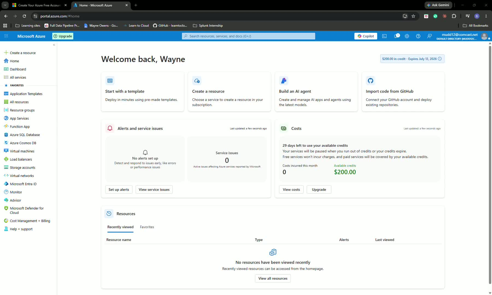
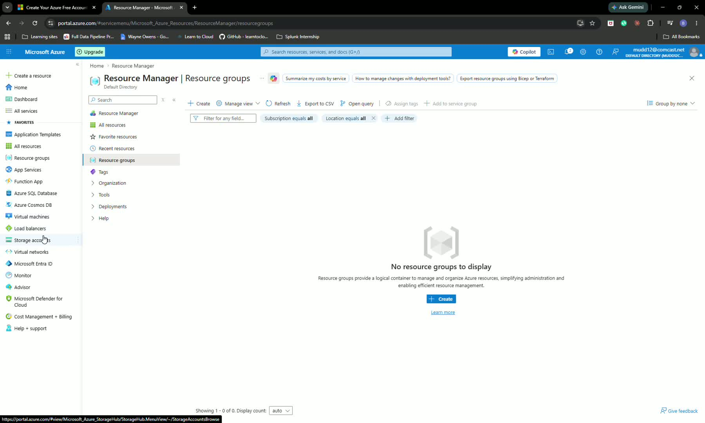
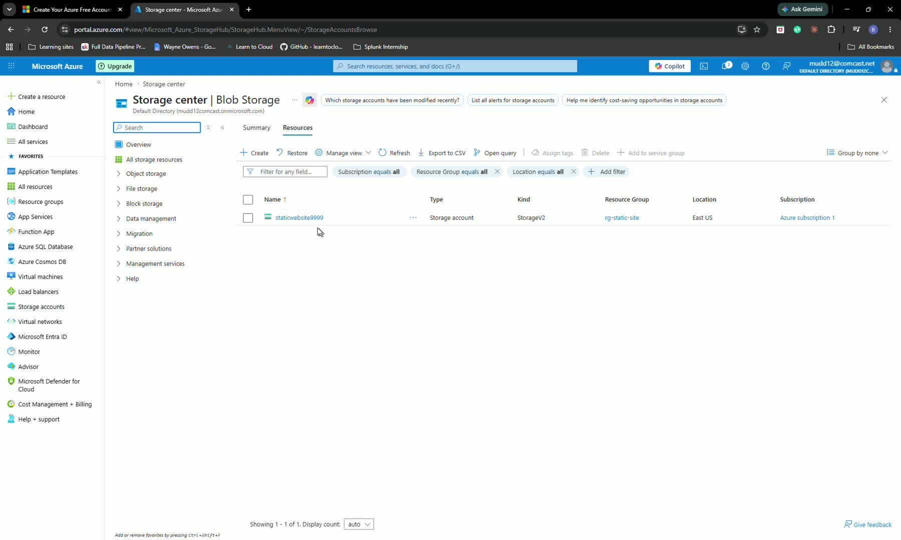

## SOP: Deploy a Static Website on Microsoft Azure Using Azure Blob Storage

### Objective

This SOP explains how to create an Azure Resource Group, provision a Storage Account, enable Static Website hosting, upload website files to the $web container, verify the site is live, and clean up resources afterward. It is intended to help a team member complete the deployment efficiently and avoid unnecessary Azure charges.

### Key Steps

**1. Create a Resource Group in Azure** [0:24](https://loom.com/share/dec13f042471437f96dc0e6f0df61804?t=24)

- Sign in to the **Microsoft Azure portal**.
- Navigate to **Resource Groups**.
- Select **Create** to start a new resource group.
- Enter the required details and complete creation.
- Confirm the resource group has been created before moving on.

**2. Create a Storage Account for the Website** [1:11](https://loom.com/share/dec13f042471437f96dc0e6f0df61804?t=71)

- Go to **Storage Accounts** and select **Create**.
- Choose the **resource group** created in the previous step.
- Enter a **globally unique Storage Account name**. 
  - If the name is already taken, add random numbers or a unique suffix.
- Select **Locally Redundant Storage (LRS)**.
- Keep **Standard Performance** selected.
- Click **Review + Create**, then **Create**.
- Wait for deployment to complete.

**3. Enable Static Website Hosting** [2:24](https://loom.com/share/dec13f042471437f96dc0e6f0df61804?t=144)

- Open the newly created **Storage Account**.
- In the left menu, find **Data Management** and select **Static website**.
- Change the setting from **Disabled** to **Enabled**.
- Set the **Index document name** to `index.html`.
- Set the **Error document path** to `404.html`.
- Save the configuration.

**4. Upload Website Files to the $web Container** [3:17](https://loom.com/share/dec13f042471437f96dc0e6f0df61804?t=197)

- Go to **Data Storage** &gt; **Containers**.
- Open the special container named `$web`.
- Select **Upload**.
- Browse to the website files on your computer.
- Upload at minimum the `index.html` file.
- Confirm the file appears in the `$web` container after upload.

**5. Verify the Website Is Live** [4:25](https://loom.com/share/dec13f042471437f96dc0e6f0df61804?t=265)

- Return to the **Static website** settings page in the Storage Account.
- Copy the **Primary endpoint URL** shown there.
- Open a new browser tab.
- Paste the URL into the address bar and load the page.
- Confirm the static website displays correctly.

**6. Clean Up Azure Resources to Avoid Charges** [4:48](https://loom.com/share/dec13f042471437f96dc0e6f0df61804?t=288)

- Return to **Resource Groups** in the Azure portal.
- Open the resource group created for this deployment.
- Select **Delete resource group**.
- Type or paste the exact resource group name to confirm deletion.
- Complete the delete action and verify the resource group is removed.

### Cautionary Notes

- **Storage account names must be globally unique** across Azure; choose a unique name before creating the account.
- Ensure the correct **resource group** is selected so resources are organized and easy to delete later.
- Double-check the **index document name** and **error document path** match the files you upload.
- Upload files to the `$web` container only; this is the required container for Azure static website hosting.
- Delete the resource group when finished to prevent ongoing Azure charges.

### Tips for Efficiency

- Prepare `index.html` and `404.html` locally before starting the Azure setup.
- Use a consistent naming convention for resource groups and storage accounts to simplify management.
- Keep the static website URL handy for quick testing after deployment.
- If a storage account name is unavailable, append a short numeric suffix instead of reworking the entire name.
- Clean up immediately after testing to avoid unnecessary billing.

### Link to Loom

<https://loom.com/share/dec13f042471437f96dc0e6f0df61804>
